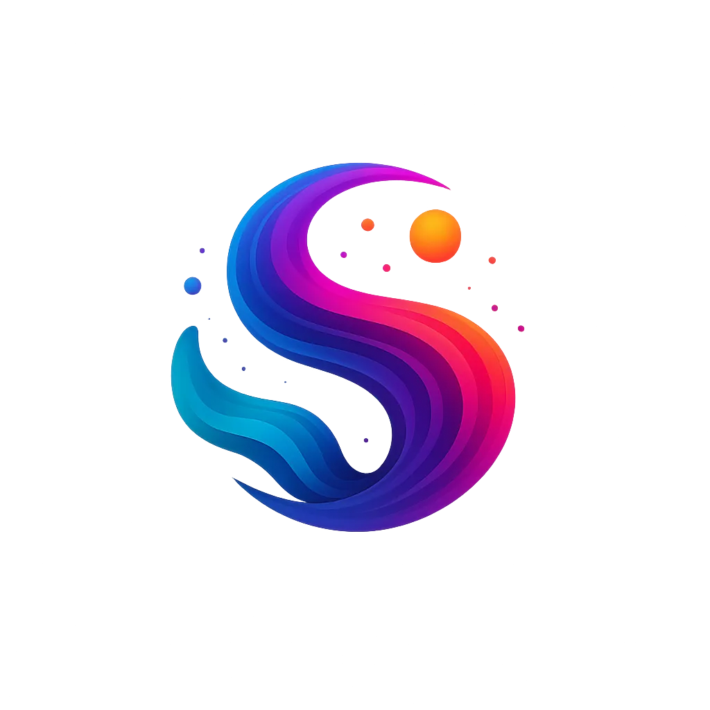

<p align="center">
  
</p>

# Mirage

A standalone, self-hosted web app for real-time 3D music visualization. 26 scenes powered by Three.js, microphone audio input, shareable sessions, admin dashboard, and optional Cloudflare R2 storage for textures.

## Quick Start

```bash
bun install
bun run dev
```

Open [http://localhost:4444](http://localhost:4444).

## Features

- **26 Three.js scenes** across 5 categories (Organic, Cosmic, Geometric, Abstract, Immersive)
- **Audio-reactive** — connect your mic and visuals respond to music in real time
- **Shareable sessions** — create a session via the API, share the URL
- **Custom textures** — upload images as overlays on any scene
- **Color presets** — 8 built-in palettes plus custom colors and auto-cycling
- **Per-scene parameters** — each scene exposes its own tunable controls
- **Post-processing** — bloom, tone mapping, fog depth

## Texture Storage (Cloudflare R2)

Mirage supports two modes for custom texture images:

| Mode                 | How it works                                                                   | When to use                                                    |
| -------------------- | ------------------------------------------------------------------------------ | -------------------------------------------------------------- |
| **Base64 (default)** | Images are optimized client-side and stored as data URLs in the session config | No setup needed — works out of the box                         |
| **Cloudflare R2**    | Images are uploaded to an R2 bucket and served through a proxy route           | Better for larger images, multiple sessions, or production use |

### Setting up R2

Run the interactive setup script:

```bash
bash scripts/setup-r2.sh
```

The script will:

1. **Ask for your Cloudflare Account ID** — found in the dashboard URL or R2 overview sidebar
2. **Ask for a Cloudflare API Token** — needs "Edit R2" permission ([create one here](https://dash.cloudflare.com/profile/api-tokens))
3. **Create the R2 bucket** automatically via the Cloudflare API
4. **Open the R2 API Tokens page** — you create an S3-compatible token here (the one manual step)
5. **Ask you to paste the Access Key ID and Secret** from step 4
6. **Test the credentials** against the bucket
7. **Write everything to `.env`**

After setup, restart Mirage (`bun run dev`) and texture uploads will automatically use R2.

### How textures are served

When R2 is configured, uploaded textures are served through `/api/textures/...` — a built-in proxy route. This means your R2 bucket doesn't need to be publicly accessible.

If you later enable public access (r2.dev subdomain or custom domain), add the URL to `.env`:

```bash
S3_PUBLIC_URL=https://your-bucket.r2.dev
```

This bypasses the proxy for faster direct serving.

### Manual R2 configuration

If you prefer to configure R2 manually instead of using the script, add these to your `.env`:

```bash
S3_BUCKET=mirage-textures
S3_REGION=auto
S3_ENDPOINT=https://<your-account-id>.r2.cloudflarestorage.com
S3_ACCESS_KEY_ID=<your-access-key>
S3_SECRET_ACCESS_KEY=<your-secret-key>
S3_FORCE_PATH_STYLE=true
```

## Dashboard

Mirage includes a dashboard at `/dashboard` for managing sets, API keys, account settings, and admin functions.

### First-time setup

Set an initial admin username and password via environment variables:

```bash
ADMIN_USERNAME=admin
ADMIN_EMAIL=admin@example.com
ADMIN_PASSWORD=your-secure-password   # min 8 characters
```

On first startup, Mirage seeds the database with this admin user. After that, you can create additional users and API keys from the dashboard.

> **Security note:** `ALLOW_REGISTRATION` defaults to `true`, meaning anyone can create an account. Set `ALLOW_REGISTRATION=false` after creating your admin account to prevent public sign-ups.

### Generating JWT_SECRET

The `JWT_SECRET` is used to sign session JWTs. If not set, it falls back to `ADMIN_PASSWORD`. For production, generate a dedicated secret:

```bash
# Using openssl (recommended)
openssl rand -base64 32

# Using Node.js / Bun
node -e "console.log(require('crypto').randomBytes(32).toString('base64'))"
```

Add it to your `.env`:

```bash
JWT_SECRET=your-generated-secret-here
```

### API key management

From the dashboard you can create and revoke API keys. Keys use the format `mk_` + 32 random characters. The full key is shown once at creation and stored as a SHA-256 hash. If no API keys exist in the database, session creation is open (no auth required).

## Environment Variables

| Variable               | Required | Default            | Description                                            |
| ---------------------- | -------- | ------------------ | ------------------------------------------------------ |
| `DATABASE_URL`         | No       | `./data/mirage.db` | SQLite database path                                   |
| `JWT_SECRET`           | No       | —                  | JWT signing secret (falls back to `ADMIN_PASSWORD`)    |
| `ADMIN_USERNAME`       | No       | `admin`            | Initial admin username (first-time setup)              |
| `ADMIN_EMAIL`          | No       | —                  | Initial admin email (required for first-time setup)    |
| `ADMIN_PASSWORD`       | No       | —                  | Initial admin password (min 8 chars)                   |
| `ALLOW_REGISTRATION`   | No       | `true`             | Set to `false` to disable public user registration     |
| `S3_BUCKET`            | No       | —                  | R2/S3 bucket name                                      |
| `S3_REGION`            | No       | `us-east-1`        | Use `auto` for R2                                      |
| `S3_ENDPOINT`          | No       | —                  | R2: `https://<account-id>.r2.cloudflarestorage.com`    |
| `S3_ACCESS_KEY_ID`     | No       | —                  | R2 API token access key                                |
| `S3_SECRET_ACCESS_KEY` | No       | —                  | R2 API token secret key                                |
| `S3_FORCE_PATH_STYLE`  | No       | `true`             | Required for R2/MinIO                                  |
| `S3_PUBLIC_URL`        | No       | —                  | Public URL for direct texture serving (bypasses proxy) |

## API

| Method   | Path                      | Auth                     | Description                   |
| -------- | ------------------------- | ------------------------ | ----------------------------- |
| `POST`   | `/api/sessions`           | API key                  | Create session                |
| `GET`    | `/api/sessions/[id]`      | None                     | Read session (public)         |
| `PUT`    | `/api/sessions/[id]`      | Admin token              | Update config/texture         |
| `DELETE` | `/api/sessions/[id]`      | Admin token              | Delete session                |
| `POST`   | `/api/upload`             | Admin token + session ID | Upload texture to R2          |
| `GET`    | `/api/textures/[...path]` | None                     | Proxy texture from R2         |
| `GET`    | `/api/health`             | None                     | Health check + storage status |

## Docker

```bash
docker compose up -d
```

Mirage runs on port 4444. Mount `./data/` for persistent storage. Pass R2 env vars through `docker-compose.yml` or a `.env` file.

## Unraid

Mirage includes a ready-made Unraid Community Applications template. Follow these steps to install it on your Unraid server.

### Prerequisites

- Unraid 6.12+ with Docker enabled

### Step 1: Pull the Docker image

The image is published to GitHub Container Registry on every push to `main`:

```bash
docker pull ghcr.io/fauxvo/mirage:latest
```

### Step 2: Copy the Unraid template

Copy the `unraid-template.xml` file from this repo to Unraid's user templates directory:

```bash
# From your local machine (replace UNRAID_IP with your server's IP)
scp unraid-template.xml root@UNRAID_IP:/boot/config/plugins/dockerMan/templates-user/mirage.xml
```

Or manually copy the file:

1. Navigate to your Unraid server's flash drive: `\\UNRAID_IP\flash\config\plugins\dockerMan\templates-user\`
2. Copy `unraid-template.xml` into that folder and rename it to `mirage.xml`

### Step 3: Add the container in Unraid

1. Open the Unraid web UI
2. Go to **Docker** tab
3. Click **Add Container**
4. In the **Template** dropdown at the top, select **mirage**
5. The template auto-fills all fields — review and adjust:

| Field              | Default                    | Notes                                          |
| ------------------ | -------------------------- | ---------------------------------------------- |
| **Web UI Port**    | `4444`                     | Change if 4444 is already in use               |
| **Data Path**      | `/mnt/user/appdata/mirage` | Persistent storage for the SQLite database     |
| **JWT Secret**     | _(empty)_                  | Generate one: `openssl rand -base64 32`        |
| **Admin Username** | `admin`                    | First-time setup only                          |
| **Admin Email**    | _(empty)_                  | Required for first-time admin account creation |
| **Admin Password** | _(empty)_                  | Min 8 characters, first-time setup only        |

6. Click **Apply** to create and start the container

### Step 4: Access Mirage

Open `http://UNRAID_IP:4444` in your browser. On first launch, Mirage creates the database and seeds the admin account using the credentials you provided.

### Optional: Cloudflare R2 storage

To use R2 for texture storage instead of base64, click **Edit** on the Mirage container in the Docker tab and expand **Advanced** settings. Fill in the R2/S3 fields (bucket, endpoint, access key, secret key). See the [Texture Storage](#texture-storage-cloudflare-r2) section above for details.

### Updating

To update Mirage on Unraid:

1. Rebuild the Docker image with the latest code (or pull the latest from your registry)
2. In the Unraid Docker tab, click the Mirage container icon and select **Force Update**
3. Your data persists in `/mnt/user/appdata/mirage` — it is not affected by container updates

### Template reference

The template file (`unraid-template.xml`) defines these configuration fields:

| Config             | Type     | Display  | Description                                      |
| ------------------ | -------- | -------- | ------------------------------------------------ |
| Web UI Port        | Port     | Always   | Maps host port to container port 4444            |
| Data               | Path     | Always   | Mounts `/mnt/user/appdata/mirage` → `/app/data`  |
| JWT Secret         | Variable | Always   | Signing secret for session tokens                |
| Admin Username     | Variable | Always   | Initial admin username                           |
| Admin Email        | Variable | Always   | Initial admin email                              |
| Admin Password     | Variable | Always   | Initial admin password (masked)                  |
| Allow Registration | Variable | Always   | `true`/`false` — toggle public user registration |
| R2/S3 Bucket       | Variable | Advanced | Bucket name for texture storage                  |
| R2/S3 Region       | Variable | Advanced | `auto` for R2, or AWS region                     |
| R2/S3 Endpoint     | Variable | Advanced | R2 endpoint URL                                  |
| R2/S3 Access Key   | Variable | Advanced | S3-compatible access key (masked)                |
| R2/S3 Secret Key   | Variable | Advanced | S3-compatible secret key (masked)                |
| R2/S3 Force Path   | Variable | Advanced | Required for R2/MinIO                            |
| R2/S3 Public URL   | Variable | Advanced | Public URL for direct texture serving            |

## Development

```bash
bun install          # Install dependencies
bun run dev          # Dev server (port 4444)
bun run build        # Production build
npm test             # Run tests (use npm, not bun)
bun run lint         # ESLint
bun run format       # Prettier
```

## Tech Stack

Next.js 16 (App Router) / React 19 / Three.js / Drizzle ORM / SQLite / Tailwind CSS v4 / Zod / Bun
